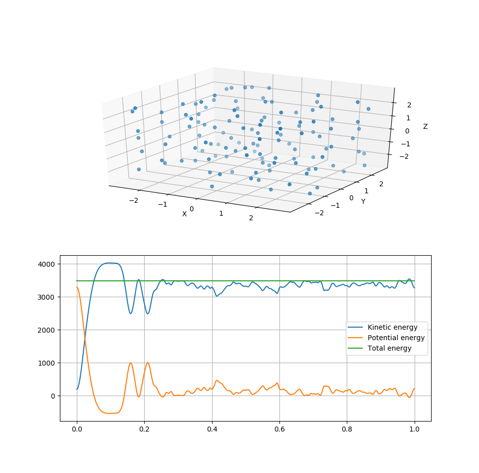

# molecular-dynamics
> A basic molecular dynamics simulator in python with dynamic visualization.

This little tool is meant to help teach the principles of molecular dynamics. It is not meant to handle real or heavy computation, but is meant to help visualize, test and learn about molecular dynamics methods. 

## Features
- dynamic 3D plotting
- dynamic energy plotting
- object oriented style

## Dependencies
- python 3.6+
- matplotlib
